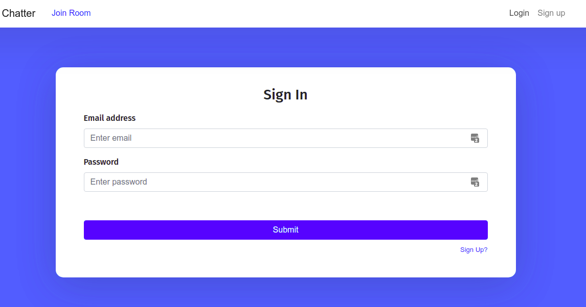

# Chatter

Scalable Real Time Chat Application

## Build and Run
```shell
docker-compose up --build
```

### To run https locally
```shell
cd nginx-proxy

## Create SSL crt and key
openssl req -x509 -nodes -days 1024 -newkey rsa:2048 -keyout localhost.key -out localhost.crt  -extensions 'v3_req'

## create pem file
cat localhost.crt localhost.key > localhost.pem

## To trust certificate
certutil -d sql:$HOME/.pki/nssdb -A -t "CT,c,c" -n "localhost" -i localhost.crt
```


## Images




